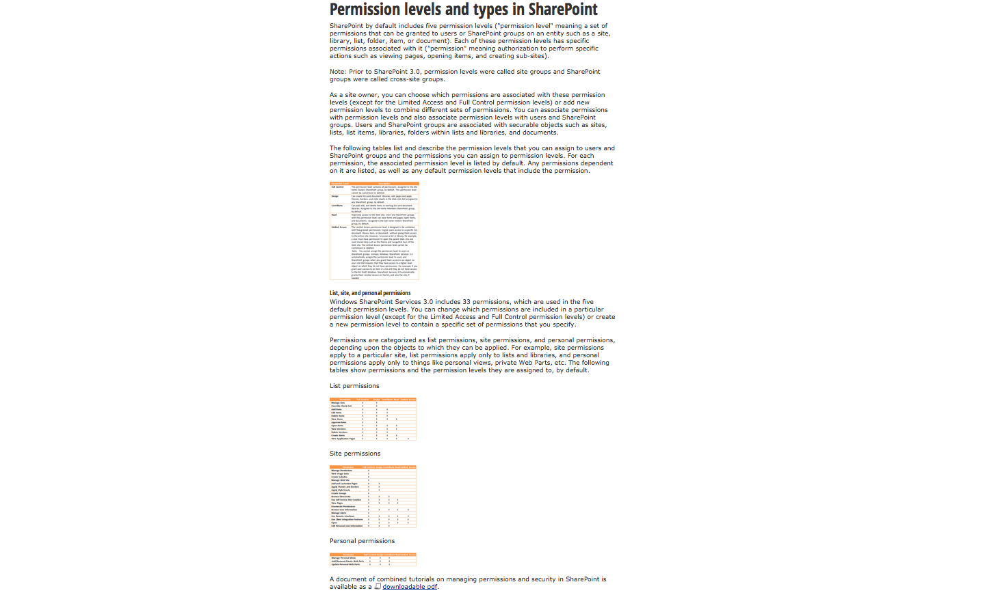

## *Lions and Tigers and*
# Handling User Capabilities

---

---

# Hi, I’m Tiffany
## @theophani

^ My name is Tiffany Conroy, or theophani most everywhere online
^ I work at SoundCloud.

^ My speciality is designing and building web-based tools, especially tools used by operational staff. At SoundCloud, for example, I design and build the user administration system used by our customer support and business development teams. I have also worked on a customer relations management system for a devision of a bank, and a few content management systems.

---

## *Lions and Tigers and*
# Handling User Capabilities

^ I’m here to talk about user capabilities, meaning the things the people **can do**, but more importantly, what they **can‘t do**.
In your career as a designer or developer of software, you will very likely encounter some kind of need to user restrict access to some feature of the software you build.
This is especially true for someone like myself who builds tools, but I imagine that this is true to some extend for many of you.

---

# (Examples)

^^^
[Example blog page with these showing/not]
[Upgrade for XXX feature]
[Online Shop UI?]

^^^
* In a WordPress blog theme, only the blog owner should see edit links, and only when they are logged in.
* Only premium users should get access to extra features.
* Only supervisors can edit product categories in an online shop.

---

^ In my own work, I build a user administration system, and I am continuously adding features, many of which should only be accessible by authorized people.

---

### On a hunt for
## ways to approach
### User Capabilities

---

### *Part I*
### The UX of User Capabilities
###  
### *Part II*
### Implementing User Capabilities

^ I have divided this talk into two parts …

---

# Part I
## The UX of
## User Capabilities

^ From a UX perspective, you should care because …

---

### Good user capability UX
## *helps people to*

---

### Good user capability UX
## *helps people to*
####  
### 1. avoid mistakes
### 2. understand their capabilities
### 3. easily manage permissions

---

### Good user capability UX
## *helps people to*
## 1. avoid mistakes

^ (part 1.1 in here)

---

## Why add user
## access restrictions
## to a system anyway?

---

## People *should not be able* to do things that they
## *are not allowed* do

^ People should not be **able** to do things that they are **not allowed** to do. [Sign: Staff Only] [Trained personnel only]

^If someone is not *allowed* to do something, then your system should not let them do it. The alternative could be that we just trust that people won’t do things they are not allowed to, but that is irresponsible.

^ This may seem so obvious there is no point is saying it, but this was not always the case. (I assume. Evidence?)

^ Also, in human societies, there are lots of examples where we don’t actually prevent people from doing things they are not allowed to do. We just **tell** them they aren’t allowed to and trust or **hope** they won’t do it.

^ In a work environment:

^ In computer environments, we don’t have to just trust people, because we do have the ability to at least attempt restricting access.

^ (Data protection laws)

^ Beyond that however, there is another idea that emerged in the 1970s:

---

## People *should not be able* to do things that they
## *do not need* to do

---

### *This is known as the*
## Principle of
## Least Privilege

^[loose notes, needs actual writing:]

^“must be able to access only the information and resources that are necessary for its legitimate purpose.”

^“A user account only has those privileges which are essential to that user’s work.”

^“protection of data and functionality from faults”

^“Applied to employees, the principle of least privilege translates to giving people the lowest level of user rights that they can have and still do their jobs.”

---

The principle *limits the potential damage*
of any security breach, whether accidental or malicious.

^“The principle was designed to ***limit the potential damage** of any security breach, whether **accidental** or malicious.”

^i.e. because:

^People should not be able to do things that they **should not** do.

^(Therefore, we have proven the need for having access restrictions)

^ For security and data integrity reasons, this principle makes a lot of sense. I think it also makes sense for user experience. You should not just allow users to make mistakes. It is not their fault if they don’t understand what they should and should not do. If you follow this principle for security reasons, you get that as a user experience essentially for free.

^ Not entirely for free though. You can’t just let people think they can do things and then it doesn’t work.

^ This leads me to my next point:

---

### Good user capability UX
## *helps people to*
## 2. understand their capabilities

^ People should understand what they can and can’t do
(and sometimes what they can’t and why)

---

###  
### *Interaction design asks*

# How does the user:
affect change?
understand the change?
understand what they can change?

---

###  
### *Interaction design asks*

# How does the user:
affect change?
understand the change?
→ understand what they can change? ←

^ This last point is exactly the reason users should understand what their capabilities are.

---

### Your UI *must* communicate
## what the person *can* do

^ One could argue that this point is not as important as this one:

---

### Your UI *must not* communicate
## that the person *can* do
## something they *can’t*

^ … because that is extremely frustrating
^ People need to know what they can and can’t do.

^ Because of this requirement, it is vital that the UI reflect what the user’s capabilities are, and should not give them the impression they can do things they can’t.

^ It is extremely poor UX for an interface to have non-functioning parts, or parts that allow you to do things should should not, and then scold you for it.

^ There are exceptions to this, such as provide a trigger which looks like it will access a feature, but instead of triggering the feature, it explains what the person needs to do to get access to the feature, such as upgrade in a commercial app, or talking to their supervisor.

---

### Good user capability UX
## *helps people to*
## 3. easily manage permissions

^ (insert stuff here about how I also have to build the interface of managing the permissions)

^ You don’t need to invent an approach. Well, you can, but first you should know what the existing ideas are that exist.

---

## *first, some*
# Definitions

^ There is a vocabulary for all this in Computer Science that is useful to know, not just to know the terms, but because it clarifies some concepts
^ I already talked about Principle of Least Privilege, but now I’ll discuss some terminology around access restrictions and two of the most well known and widely used approaches to manage access restrictions

---

## subject, object,
## operation &
## permission, capability

---

## *subject*: Active entity,
### such a user or a process.

^ Subjects are active entities, such a user or a process.

---

## *object*: Thing
### the subject acts upon.

^ Objects are the things that subjects act upon.

---

## *operation*: Action
### attempted by the subject on the object.

^ Operations are the actions attempted by the subject on the object.

---

## *permission*: the right
### to perform the operation.

^ The granted right to perform the operation.

---

## [fit] *capability*: Allowed Operation
### the subject has permission
### to perform on an object.

^ Those operations that the subject has the permission to perform on objects.

---

### *subject*: person
### *object*: thing
### *operation*: action
### *permission*: gives capability
### [fit] to a person to perform an action on a thing

^ For our purposes, I will mostly limit my discussion to **people** have the *capability* to perform **actions** on **things**.

^ I will now explain and contrast the two most widely used approaches for managing permissions, looking for which one has the best UX.

---

# ACL , RBAC
######  
### *ACL*: Access Control List
### *RBAC*: Role-Based Access Control

^ I will now explain and contrast the two most widely used approaches, looking for which one has the best UX.

---

# *ACL*
## Access Control
## List

^ An access control list (ACL) is a list of permissions for an object, and typically each entry specifies a subject and an operation for the object.

^ An access control list (ACL) is a list of people who can perform an action on a give thing.

---

##  
## Access Control List

A list of permissions where each entry specifies
a *subject* and an *operation* for the object.

^ For example, the access control list for products may be:

^
Alice can view products.
Alice can edit products.
Bob can view products.

^ (If you have interacted with a UNIX-style file system, and had to change the permissions on a file or directory, you were essentially setting the access control list.) <--- maybe omit?

---

## The *UX* of maintaining
## an *access control list*

^ When I introduced access restrictions into the system I build, I also had to build the UI for managing those access restrictions, something that non-programmers could use to onboard their new colleagues.

^ Maintaining an access control list can become very tedious.

^ Let me give you an example

---

^ Imagine you work at a warehouse, and you have just hired a new junior warehouse clerk, and you want to give them access to the order management system. The clerk’s job will be to add incoming orders into the system, check over all the orders before they leave the warehouse, and answer any questions customers have about their order, including making changes to orders that customers ask for.

^ It is your job to add the new person to your order management system, making sure they have all the permissions they need. You get a list of operations per object like this:

---

# Gross

^ This is an totally random example I pulled from the internet from a site trying to explain how to grant permissions in Sharepoint.

^ How do you know which actions to allow on which things? You would need to understand the job of a warehouse clerk very well. But this person is also a *Junior* Warehouse Clerk, so some things a more experienced clerk can do, the junior clerk should not be able to do.

^ Maybe you have a list somewhere of all the permissions a “Junior Warehouse Clerk” needs that you can refer to.

^ Maybe you have a template that you can apply called “Junior Warehouse Clerk” and it grants all the correct permissions.

^ What if the Junior Warehouse Clerk will also be working one day a week as a Sales Rep? They will make outbound calls to customers who haven’t placed orders recently. When acting as the sales rep, they need to use features that a Junior Warehouse Clerk doesn’t have access to. Maybe you have a “Sales Rep” template of permissions, but now you need a way to combine the permissions in the Sales Rep template and the Junior Warehouse Clerk template.

^ This whole thing is not manageable and hard to understand.

---

## What if you needed to *update* such a list?

^ What if the application gets new features that all the Warehouse Clerks need access to? You’d have to refer to a list of all the people work as Warehouse Clerks, and update all their permissions. And don’t forget to update your template!

---

# Not good UX

^ This web page where I lifted this screenshot from: it’s page dedicated to explaining how to grant access permissions for a particular system.

^ There is a saying:

^ A user interface is like a joke: if you have to explain it. it isn’t very good

---

### Permission
## Groups?

^ You might be thinking: what about permission groups?
That brings me to the next approach

---

## *Role-Based* Access Control to the rescue!

---

# *RBAC*
## Role-Based
## Access Control

^ Instead of granting each person a laundry list of possibly changing capacities, you think instead in terms of the roles that exist in the organization, where role means job function.

---

## *Role:* job function
### in an organization

^ but more generally…

---

## *Role:* collection of
## capabilities

^ Permission to perform certain operations are assigned to specific roles, and can be associated with more than one role.

---

## People can have
## *more than one* role

^ People are assigned roles that match to the job functions they have, and through these role assignments they are given all the capabilities they need to perform actions in the system.

---

## When a role is changed,
### people’s *capabilities change* too

^ When a new feature is added to the system, the capability is added to the roles that will be using it, and the people with those roles get the capability by extension. If someone’s job function changes, then you can add and remove the roles they are assigned, which changes the capability they will have.

^ With this approach, people granting permissions only need to understand what roles a person has. The job of connecting those roles to capabilities is managed separately, and comes up during the design and development of new features.

---

##  
# Role-Based Access Control
or
# Access Control Lists

---

## Bad UX leads to
# *mistakes*

^ We saw that Access Control Lists were hard to manage because they had poor UX

^ When the UX for managing permission is this gross, people make mistakes.

---

## Mistakes
### *can lead to violations of the*
## Principle of
## Least Privilege

^ Usually what happens, is that they can grant too much access to make sure the person can do their job. That violates the Principle of Least Privilege.

---

##  
# Role-Based Access Control
is *better UX* than
# Access Control Lists

---

## *RECAP*
# PART I

---

### Good user capability UX
## *helps people to*

### 1. avoid mistakes
### 2. understand their capabilities
### 3. easily manage permissions

---

## 1. Avoid mistakes
### by following the
### *Principle of Least Privilege*

---

### People should be able to 
## 2. understand their capabilities
### because your *IU communicates* them

---

## 3. easily manage permissions
### by using *Role-Based* Access Control

---

# Part II
## Implementing
## User Capabilities

---

Recommended approach:

1. Enforce both server-side and client-side (duh?)
2. Check capabilities, not role
3. a. Map restricted UI elements to one or more capability
3. b. Map restricted endpoints to one or more capability

Assumptions:
- client-side rendered app
- using REST APIs
- the server can tell the client what 

The server is the authority, but the client has to reflect the capabilities, therefore the client needs to be able to ask the server “what capabilities does the authenticated user have?”

---

Must enforce both server- and client-side,
but want simple, decoupled logic

Can map restricted UI elements to one or more capability.

Can map restricted endpoints to one or more capability.

---

---

# Thank you!
### *Tiffany Conroy – @theophani*

---

---

---

---

Now, access restrictions need to be **enforced on the server side**, because your web UI can be easily circumvented
(GIF: right click, view element, change an input name, save)

So does that mean you don't have to be concerned about the UI, since the server side restrictions will save you?

## 2. Communicate to people what they can and can't do

No.

Capabilities need to be **communicated in the interface** so that people know what they can and can’t do.
(GIF: "click" SORRY THAT IS NOT ALLOWED. head explode)

It is extremely poor UX for an interface to have non-functioning parts, or parts that allow you to do thinks should should not, and then scold you for it.

That means that even though the server-side has to enforce capabilities, so does the UI have to be a reflection of the capabilities the user has.

## 3. Choose an approach that makes it easy to manage capabilities

[so that people don't end up with permissions they should not have]

### 4. Choose an approach that makes it easy to enforce capabilities in both the server-side code and UI-rendering code

^ The approach I chose to make it easy to enforce capabilities in both the server-side code and UI-rendering code.

## Initial thoughts

When I first thought about this, it sounded like I would need to have logic such as “IF x, THEN y” such as “IF user is has premium access THEN show the button”.

## Permissions should be enforced in backend, and reflected in UI

This logic would need to be in two places:

1) Access restrictions need to be **enforced on the server side**, because your web UI can be easily circumvented
(GIF: right click, view element, change an input name, save)

2) Capabilities need to be **communicated in the interface** so that people know what they can and can’t do.
(GIF: "click" SORRY THAT IS NOT ALLOWED. head explode)

## Seeking pre-existing approaches

I wanted to find an approach that would avoid a lot of if/else logic everywhere in the templates, and that would avoid duplicating this kind of logic in both the server side code and the UI rendering code.

I knew I needed to do some kind of logic in client side because I did not want to require that the server-side knew too much about the UI. I really did not want something like: can_see_edit_button.

I was looking for the simplest way I could pass around information about the logging in user that will allow me to determine “should the person see the edit button”?

It was at this point that I started asking about for pre-existing approaches.

## There is a vocabulary for this in Computer Science (subject, object, operations (?) …, Principle of Least Privilege) and names for different approaches. Two most widely used / discussed: ACL, RBAC.

When I began talking to people about the approaches they used, and looking around for formalised ways of things I already knew about, I learned that there is an existing vocabulary for these concepts in computer science.

**subject**: Subjects are active entities, such a user or a process.
**object**: Objects are the things that subjects act upon.
**operation**: Operations are the actions attempted by the subject on the object.
**permission**: The granted right to perform the operation.
**capability**: Those operations that the subject has the permission to perform on objects.

For our purposes, I will sometimes limit my discussion to **people** performing **actions** on **things**.

**subject**: person
**object**: thing
**operation**: action
**permission**: gives the capability to a person to perform an action a thing

## Access control list (ACL)

An access control list (ACL) is a list of permissions for an object, and typically each entry specifies a subject and an operation for the object.

An access control list (ACL) is a list of people who can perform an action on a thing.

For example, the access control list for products may be:
Alice can view products.
Alice can edit products.
Bob can view products.

(If you have interacted with a UNIX-style file system, and had to change the permissions on a file or director, you were essentially setting the access control list.) <--- maybe omit?

## The UX of maintaining permissions

When I introduced access restrictions into the system I build, I also had to build the UI for managing those access restrictions, something that non-programmers could use to onboard their new colleagues.

Maintaining an access control list can become very tedious.

Imagine you have just hired a new junior warehouse clerk, and you want to give them access to the order management system. The clerk’s job will be to add incoming orders into the system, check over all the orders before they leave the warehouse, and answer any questions customers have about their order, including making changes to orders that customers ask for.

It is your job to add the new person to your system, making sure they have all the permissions they need, and you get a list of operations per object like this:

[long list of objects and operations]

How do you know which actions to allow on which things? You would understand the job of a warehouse clerk very well. But this person is also a *Junior* Warehouse Clerk, so some things a more experienced clerk can do, the junior clerk should not be able to do.

Maybe you have a template that you can apply called “Junior Warehouse Clerk” and it grants all the correct permissions.

What if the Junior Warehouse Clerk will also be working one day a week as a Sales Rep? They will make outbound calls to customers who haven’t placed orders recently. When acting as the sales rep, they need to use features that a Junior Warehouse Clerk doesn’t have access to. Maybe you have a “Sales Rep” template of permission, but now you need a way to combine the permissions in the Sales Rep template and the Junior Warehouse Clerk template.

What if the application gets new features that all the Warehouse Clerks need access to? You’d have to refer to a list of all the people work as Warehouse Clerks, and update all their permissions. And don’t forget to update your template!

(Aside: Yes, I am intentionally ignoring the idea of groups in this description of access control lists. More on that in a moment.)

## Role-Based Access Control (RBAC)

Role-Based Access Control to the rescue!

Instead of granting each person a laundry list of possibly changing capacities, you think instead in terms of the roles that exist in the organization, where role means job function.

Permission to perform certain operations are assigned to specific roles, and can be assigned to more than one role.

People are assigned roles that match to the job functions they have, and through these role assignments they are given all the capabilities they need to perform actions in the system.

When a new feature is added to the system, the capability is added to the roles that will be using it, and the people with those roles get the capability by extension. If someone’s job function changes, then you can add and remove the roles they are assigned, which changes the capability they will have.

## Distinction / lack of distinction between ACL and RBAC

Just a quick note back to access control lists: many applications of access control lists that you encounter have the concept of “groups” which allows for the exact same benefits as roles in Role-Based Access Control. The difference is primary semantic: Role-Based Access Control focusses on the groups as organisational roles that people have that describe what those people can do.

## Principle of Least Privilege

SEGUE MISSING

## Examples of operations a user with a role might conduct.

## Defining roles together with the people who perform the job, and assigning roles by / together with the people who manage / supervise the operators.

## Recap

We define roles, we define what capabilities those roles have, then we assign people to those roles. When the person is authenticated, we know who they are and what their capabilities are.

Now, if we need to see if a person can do something, we

if ( user.capabilities.indexOf("view orders") > -1 ) {
	// so simple!
}

But what if the UI element is something more complicated? Maybe it’s a dropdown  menu with three actions in it, and if the person can’t do any of the actions, then you don’t want to show the menu at all? You would have:

if (
	user.capabilities.indexOf("action one") > -1 ||
	user.capabilities.indexOf("action two") > -1 ||
	user.capabilities.indexOf("action three") > -1
) {
	// gross :(
}

## can function

We want a function that works like this:

can (user, ["view orders"]) // true if user can view orders
can (user, ["action one", "action two", "action three"]) // returns true if you can do any

function can (user, requiredCapabilities) {
	return requiredCapabilities.some(function (capability) {
		return user.capabilities.indexOf(capability) > -1
	})
}

If you wanted to know if the user could do both of two things, then you could do:

can (user, ["action one"]) && can (user, ["action two"])

## Using capabilities instead of roles

Because we look at the capabilities, and not the role, instead of something gross like this:

if (
	operator.role === "Junior Warehouse Clerk" ||
	operator.role === "Warehouse Clerk" ||
	operator.role === "Warehouse Manager"
) {
	// oh gawd no!!!
}

We can do this:

if ( can (operator, ["view orders"]) ) {
	// so simple!
}

if ( operator.capabilities.indexOf("view orders") > -1 ) {
	// so simple!
}

All the logic that explains taht a "Junior Warehouse Clerk" and "Warehouse Clerk" and a "Warehouse Manager" can all see the "View Orders" button is captured in the definitions of the roles  themselves.

## Another application

Let's look at this same idea but with another application: free verses premium users:

if (
	user.plan === "level1" ||
	user.plan === "free" ) {
	// what if you get a new plan type?
}

We can do this:

if ( can (user, ["upgrade_to_level2"]) ) {
}

### Anonymous versus signed in users:

if ( user.signedIn ) {
	// okay, not so bad
}

We could also do something like this:

if ( can (user, ["edit"]) ) {
}

## How I ended up implementing these ideas
(css does not work. show. with math?)

## -Naive ideas to implement: Are these approaches good / bad / where should the logic go?- [remove section maybe?]

(when thinking about how to do this, it will seem to get complicated)
can_see_edit_button <-- wrong, but why?
Need to determine calculate the logic for this somewhere. can(cap1, cap2, cap3) is all that is needed.

(When rendering the templates, only some users should see the “Edit” button, or the “Daily Reports” tab.)

## Meta Lesson: If you know the domain, it is easy (/ obvious how) to write the code. What is hard is recognising when to step back, and it is hard to know what questions to ask.
