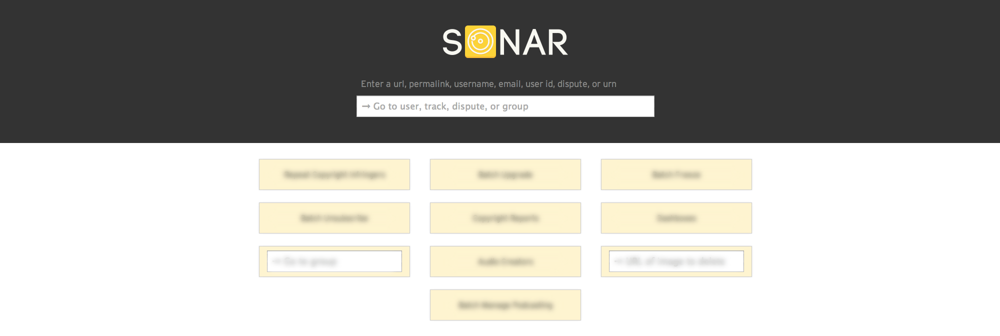
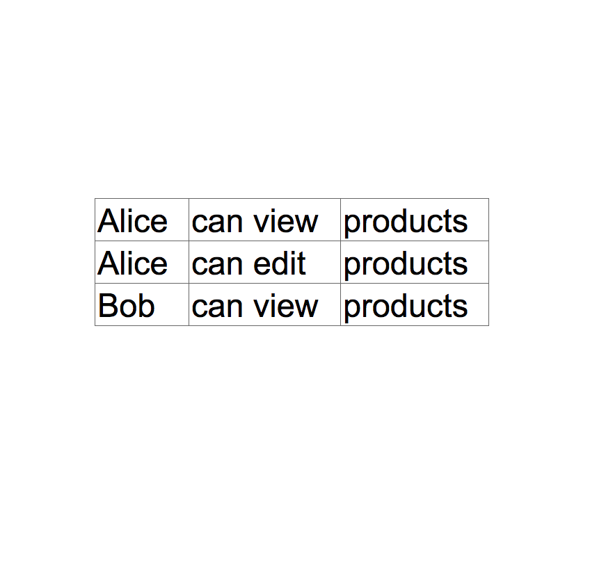
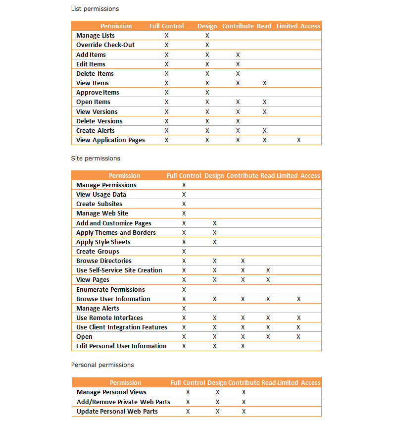
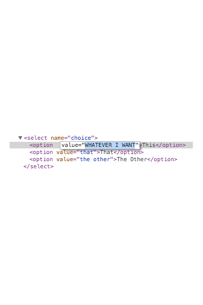
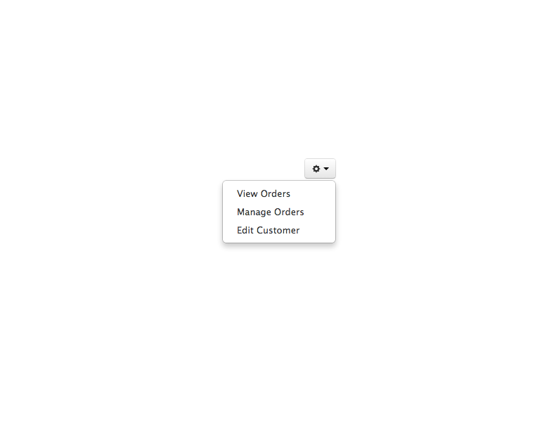

## *Lions and Tigers and*
# Handling User Capabilities

---


---

# Hi, I’m Tiffany
## @theophani


^ My name is Tiffany Conroy, or theophani most everywhere online
^ I work at SoundCloud.

^ My speciality is designing and building web-based tools, especially tools used by operational staff. At SoundCloud, for example, I design and build the user administration system used by our customer support and business development teams. I have also worked on a customer relations management system for a devision of a bank, and a few content management systems.

---

## *Lions and Tigers and*
# Handling User Capabilities

^ I’m here to talk about user capabilities, meaning the things the people **can do**, but more importantly, what they **can‘t do**.
In your career as a designer or developer of software, you will very likely encounter some kind of need to -restrict- access to some feature of the software you build.
This is especially true for someone like myself who builds tools, but I imagine that this is true to some extend for many of you.

---

### (Examples)

^
* In a WordPress blog theme, only the blog owner should see edit links, and only when they are logged in.
* Only premium users should get access to extra features.
* Only supervisors can edit product categories in an online shop.

---



^ In my own work, I build a user administration system, and I am continuously adding features, many of which should only be accessible by authorized people.

---

### On a hunt for
## ways to approach
### User Capabilities

^ When I wanted to introduce access restrictions to the application I build, I went on a hunt for existing approaches to   for handling user access restrictions, and I’ve gathered my findings to share with you.

---

### *Part I*
### The UX of User Capabilities
### <br>
### *Part II*
### Implementing User Capabilities

^ I have divided this talk into two parts …

---

# Part I
## The UX of
## User Capabilities


^ From a UX perspective, you should care because …

---

### Good user capability UX
## *helps people to*

---

### Good user capability UX
## *helps people to*
#### <br>
### 1. avoid mistakes
### 2. understand their capabilities
### 3. easily manage permissions

---

### Good user capability UX
## *helps people to*
## 1. avoid mistakes

^ So, first.

---

## Why add user
## access restrictions
## to a system anyway?

---

## People *should not be able* to do things that they
## *are not allowed* do

^ People should not be **able** to do things that they are **not allowed** to do.

^ This may seem so obvious there is no point is saying it

^If someone is not *allowed* to do something, then your system should not let them do it. The alternative could be that we just trust that people won’t do things they are not allowed to, but that is irresponsible.

^ Also, in human societies, there are lots of examples where we don’t actually prevent people from doing things they are not allowed to do. We just **tell** them they aren’t allowed to and trust or **hope** they won’t do it.

^ In computer environments, we don’t have to just trust people, because we do have the ability to at least attempt restricting access.

^ (Data protection laws)

^ Beyond that however, there is another idea that emerged in the 1970s:

---

## People *should not be able* to do things that they
## *do not need* to do

---

### *This is known as the*
## Principle of
## Least Privilege

^[loose notes, needs actual writing:]

^“must be able to access only the information and resources that are necessary for its legitimate purpose.”

^“A user account only has those privileges which are essential to that user’s work.”

^“protection of data and functionality from faults”

^“Applied to employees, the principle of least privilege translates to giving people the lowest level of user rights that they can have and still do their jobs.”

---

The principle *limits the potential damage*
of any security breach, whether accidental or malicious.

^“The principle was designed to ***limit the potential damage** of any security breach, whether **accidental** or malicious.”

^i.e. because:

^People should not be able to do things that they **should not** do.

^(Therefore, we have proven the need for having access restrictions)

^ For security and data integrity reasons, this principle makes a lot of sense. I think it also makes sense for user experience. You should not just allow users to make mistakes. It is not their fault if they don’t understand what they should and should not do. If you follow this principle for security reasons, you get that as a user experience essentially for free.

^ Not entirely for free though. You can’t just let people think they can do things and then it doesn’t work.

^ This leads me to my next point:

---

### Good user capability UX
## *helps people to*
## 2. understand their capabilities

^ People should understand what they can and can’t do
(and sometimes what they can’t and why)

---

### <br>
### *Interaction design asks*

# How does the user:
affect change?
understand the change?
understand what they can change?

---

### <br>
### *Interaction design asks*

# How does the user:
affect change?
understand the change?
→ understand what they can change? ←

^ This last point is exactly the reason users should understand what their capabilities are.

---

### Your UI *must* communicate
## what the person *can* do

^ One could argue that this point is not as important as this one:

---

### Your UI *must not* communicate
## that the person *can* do
## something they *can’t*

^ … because that is extremely frustrating
^ People need to know what they can and can’t do.

^ Because of this requirement, it is vital that the UI reflect what the user’s capabilities are, and should not give them the impression they can do things they can’t.

^ It is extremely poor UX for an interface to have non-functioning parts, or parts that allow you to do things should should not, and then scold you for it.

^ There are exceptions to this, such as provide a trigger which looks like it will access a feature, but instead of triggering the feature, it explains what the person needs to do to get access to the feature, such as upgrade in a commercial app, or talking to their supervisor.

---

### Good user capability UX
## *helps people to*
## 3. easily manage permissions

^ (insert stuff here about how I also have to build the interface of managing the permissions)

^ You don’t need to invent an approach. Well, you can, but first you should know what the existing ideas are that exist.

---

## *first, some*
# Definitions

^ There is a vocabulary for all this in Computer Science that is useful to know, not just to know the terms, but because it clarifies some concepts
^ I already talked about Principle of Least Privilege, but now I’ll discuss some terminology around access restrictions and two of the most well known and widely used approaches to manage access restrictions

---

## subject, object,
## operation &
## permission, capability

---

## *subject*: Active entity,
### such a user or a process.

^ Subjects are active entities, such a user or a process.

---

## *object*: Thing
### the subject acts upon.

^ Objects are the things that subjects act upon.

---

## *operation*: Action
### attempted by the subject on the object.

^ Operations are the actions attempted by the subject on the object.

---

## *permission*: the right
### to perform the operation.

^ The granted right to perform the operation.

---

## [fit] *capability*: Allowed Operation
### the subject has permission
### to perform on an object.

^ Those operations that the subject has the permission to perform on objects.

---

### *subject*: person
### *object*: thing
### *operation*: action
### *permission*: gives capability
### [fit] to a person to perform an action on a thing

^ For our purposes, I will mostly limit my discussion to **people** have the *capability* to perform **actions** on **things**.

^ I will now explain and contrast the two most widely used approaches for managing permissions, looking for which one has the best UX.

---

# ACL , RBAC
###### <br>
### *ACL*: Access Control List
### *RBAC*: Role-Based Access Control

^ I will now explain and contrast the two most widely used approaches, looking for which one has the best UX.

---

# *ACL*
## Access Control
## List

^ An access control list (ACL) is a list of permissions for an object, and typically each entry specifies a subject and an operation for the object.

^ An access control list (ACL) is a list of people who can perform an action on a give thing.

---



## <br>
## Access Control List

A list of permissions where each entry specifies
a *subject* and an *operation* for the object.

^ For example, the access control list for products may be:

^
Alice can view products.
Alice can edit products.
Bob can view products.

^ (If you have interacted with a UNIX-style file system, and had to change the permissions on a file or directory, you were essentially setting the access control list.) <--- maybe omit?

---

## The *UX* of maintaining
## an *access control list*

^ When I introduced access restrictions into the system I build, I also had to build the UI for managing those access restrictions, something that non-programmers could use to onboard their new colleagues.

^ Maintaining an access control list can become very tedious.

^ Let me give you an example

---


^ Imagine you work at a warehouse, and you have just hired a new junior warehouse clerk, and you want to give them access to the order management system. The clerk’s job will be to add incoming orders into the system, check over all the orders before they leave the warehouse, and answer any questions customers have about their order, including making changes to orders that customers ask for.

^ It is your job to add the new person to your order management system, making sure they have all the permissions they need. You get a list of operations per object like this:

---



# Gross

^ This is an totally random example I pulled from the internet from a site trying to explain how to grant permissions in Sharepoint.

^ How do you know which actions to allow on which things? You would need to understand the job of a warehouse clerk very well. But this person is also a *Junior* Warehouse Clerk, so some things a more experienced clerk can do, the junior clerk should not be able to do.

^ Maybe you have a list somewhere of all the permissions a “Junior Warehouse Clerk” needs that you can refer to.

^ Maybe you have a template that you can apply called “Junior Warehouse Clerk” and it grants all the correct permissions.

^ What if the Junior Warehouse Clerk will also be working one day a week as a Sales Rep? They will make outbound calls to customers who haven’t placed orders recently. When acting as the sales rep, they need to use features that a Junior Warehouse Clerk doesn’t have access to. Maybe you have a “Sales Rep” template of permissions, but now you need a way to combine the permissions in the Sales Rep template and the Junior Warehouse Clerk template.

^ This whole thing is not manageable and hard to understand.

---

## What if you needed to *update* such a list?

^ What if the application gets new features that all the Warehouse Clerks need access to? You’d have to refer to a list of all the people work as Warehouse Clerks, and update all their permissions. And don’t forget to update your template!

---

# Not good UX


^ This web page where I lifted this screenshot from: it’s page dedicated to explaining how to grant access permissions for a particular system.

^ There is a saying:

^ A user interface is like a joke: if you have to explain it. it isn’t very good

---

### Permission
## Groups?

^ You might be thinking: what about permission groups?
That brings me to the next approach

---

## *Role-Based* Access Control to the rescue!

---

# *RBAC*
## Role-Based
## Access Control

^ Instead of granting each person a laundry list of possibly changing capacities, you think instead in terms of the roles that exist in the organization, where role means job function.

---

## *Role:* job function
### in an organization

^ but more generally…

---

## *Role:* collection of
## capabilities

^ Permission to perform certain operations are assigned to specific roles, and can be associated with more than one role.

---

## People can have
## *more than one* role

^ People are assigned roles that match to the job functions they have, and through these role assignments they are given all the capabilities they need to perform actions in the system.

---

## When a role is changed,
### people’s *capabilities change* too

^ When a new feature is added to the system, the capability is added to the roles that will be using it, and the people with those roles get the capability by extension. If someone’s job function changes, then you can add and remove the roles they are assigned, which changes the capability they will have.

^ With this approach, people granting permissions only need to understand what roles a person has. The job of connecting those roles to capabilities is managed separately, and comes up during the design and development of new features.

---

## <br>
# Role-Based Access Control
or
# Access Control Lists

---

## Bad UX leads to
# *mistakes*

^ We saw that Access Control Lists were hard to manage because they had poor UX

^ When the UX for managing permission is this gross, people make mistakes.

---

## Mistakes
### *can lead to violations of the*
## Principle of
## Least Privilege

^ Usually what happens, is that they can grant too much access to make sure the person can do their job. That violates the Principle of Least Privilege.

---

## <br>
# Role-Based Access Control
is *better UX* than
# Access Control Lists

^ (redundant?)
^ We saw that Access Control Lists were hard to manage because the person managing the permissions would need to assign a collection of granular capabilities, which means they would need to have a detailed understanding the kind of work a person will be doing. Figuring out how a role matches a set of capabilities is a thoughtful process that should be done collaboratively between a product designer and the people who understand the roles. All the reasoning that maps interactions to roles is stored as the relationship between the role and its capabilities.

---

## *RECAP*
# PART I

---

### Good user capability UX
## *helps people to*

### 1. avoid mistakes
### 2. understand their capabilities
### 3. easily manage permissions

---

## 1. Avoid mistakes
### by following the
### *Principle of Least Privilege*

---

### People should be able to 
## 2. understand their capabilities
### because your *IU communicates* them

---

## 3. easily manage permissions
### by using *Role-Based* Access Control

---

# Part II
## Implementing
## User Capabilities


---

## but first, my
# *assumptions*

^
- we are talking about implementation in client-side rendered apps
- that use REST APIs to load and save data asynchronously
- and the server can tell the client details about the authenticated user.
- Though, same ideas can apply to server-side rendered views as well.

---

^ Following directly from my conclusions about UX, I had these constraints when I thought about implementing user access restrictions:

## [fit] Implementation Constraints:
### <br>
### 1. only grant *necessary* capabilities
### 2. UI must *communicate* capabilities
### 3. use *Role-based* Access Control

^ I also had this additional constraint when it came to the implementation, which is so fundamental, I will number it zero:

---

### 0. The server-side must
### enforce the restrictions

^ Access restrictions need to be enforced on the server side, because your web UI can be easily circumvented

---



### [fit] The server-side must
### [fit] enforce the restrictions
### <br>
### [fit] ← or else stuff like this is possible

^ The server must be the authority on what access rights the user has.

---
### the server-side must
## enforce the restrictions,
#### <br>
### and the client-side must
## reflect the restrictions

^ Therefore, the server-side must enforce the restrictions, and the client-side must reflect the restrictions

^ This conclusion made me worried that I was going to have to duplicate logic in multiple places in both server code and client code, and I wanted to find a way for this to be as simple as possible. I knew I wanted to avoid logic like this:

---

```javascript
// Don’t do this

if ( "Junior Warehouse Clerk" in user.roles ||
     "Warehouse Clerk"        in user.roles ||
     "Warehouse Manager"      in user.roles ) {
     // Show "View Orders" button ...
}
```

^ The problem with this approach is: what if these roles change definition, or you added new roles? You would have to update the code everywhere.

^ With this approach, you are in affect defining how a role controls access, which goes against the point of having roles defined as a collection of capabilities.

^ In other works, all the logic that explains that a "Junior Warehouse Clerk" and "Warehouse Clerk" and a "Warehouse Manager" can all see the "View Orders" button is captured in the definitions of the roles  themselves.

^ So, instead your logic should focus on the capabilities directly:

---

```javascript
// Do it like this!

if ( "view orders" in user.capabilities ) {

     // Show "View Orders" button ...

}
```

^ Since the client has to know the capabilities, the client needs to be able to ask the server “what capabilities does the authenticated user have?” (or the server has to proactively tell it)

---

```javascript
$.ajax(
  url: "/_api/me/capabilities",
  success: function (response) {
    user.capabilities = response.capabilities
  }
})
```

^ … which if you needed to, you could implement by asking for the capabilities of the signed in user before you could began rendering the UI

^ You’ll want this collection of capabilities to be current, so if your app never does a full reload, you’ll need to have a strategy for refreshing the list of capabilities

---

```javascript
// Checking for one capability

if ( "view orders" in user.capabilities ) {

     // Show "View Orders" button ...

}
```

^ So this is for checking for one capability. But what if the UI element is something more complicated?

---



^ Maybe the UI element is a dropdown menu with three actions in it. If the person can’t do any of the actions, then you don’t want to show the menu at all.

---

```javascript
// Checking for more than one capability

if ( "view orders"      in user.capabilities ||
     "edit orders"      in user.capabilities ||
     "manage customers" in user.capabilities ) {
     // Show drop down menu icon ...
}
```

^ You would need something like this.

^ By definition, the “capabilities” that a person has are the ones they *need* in order to complete a process.

---

#### *[This kind of]*
#### <br>
## Capability checking
## is *additive*

^ Because having any one capability is sufficient, the logic becomes purely additive, meaning “can this, that or the other” and never something complex such as “can this and that, or this and the other”

---

^ It would be nice to have a convenience method that worked like this:

```javascript
can ( user, ["view orders"]  )
// returns true if user can view orders

can ( user, ["action one", "action two", "action three"] )
 // returns true if the user can do any of the actions
```
---

```javascript
function can (user, requiredCapabilities) {
    return requiredCapabilities.some(function (capability) {
        return capability in user.capabilities
    })
}
```

^ Here is an implementation of the can method

---

^ If you wanted to know if the user could do something then you would have:

```javascript
if ( can (user, ["do something"]) ) {
    // ...
}

```

---

^ and you wanted to know if the user could do either of two things, you would have:

```javascript
if ( can (user, ["do action", "do another action"]) ) {
    // ...
}
```

---

## What about
## “Logic-less” Templates?

^ Hands up if you have ever used mustache templates

---

```javascript
// in your view code
mustache.render(template, {
    can: user.capabilities,
    // ...
})
```

```html
<!-- in your mustache template -->
{{#can.viewOrders}}
    <a link=“/orders">View Orders</a>
{{/can.viewOrders}}
```

^ You could also pass in the user’s capabilities as the view variable “can” and then you get something such as this.

^ If the user’s capabilities are an object with named properties for the capabilities they have, then you can get the same kind of logic in your template like this

^ This does get a bit more intense if you have more than one capability you are checking.

---

^ So say you have the kind of menu we mentioned like this:

```html
<nav>
  {{#can.viewOrders}}
	  <a link="/orders">View Orders</a>
  {{/can.viewOrders}}
  {{#can.createOrders}}
	  <a link="/orders/new">Add Order</a>
  {{/can.createOrders}}
</nav>
```

^ If the user can’t view orders nor create orders, they should not see this menu, but if they can either view orders or create orders, they should be able to see this menu.

---

```html
<!-- This doesn’t work -->
{{#can.viewOrders}}
    {{#can.createOrders}}
        <nav> ... </nav> 
    {{/can.createOrders}}
{{/can.viewOrders}}
```
<br>

^ You can’t do something such as this with nested blocks, because this is an AND operation, not an OR.

---

```javascript
var capabilities = user.capabilities

if ( can(user, ["view orders", "create orders"]) ) {
    capabilities.viewMenu = true;
}

mustache.render(template, {
    can: capabilities,
    // ...
})
```

^ Instead, you can augment the user’s capabilities with view-specific ones before passing them into the mustache render method

---

```html
{{#can.viewMenu}}
    <nav> ... </nav>
{{/can.viewMenu}}
```

^ and then you can use this resulting value in the template.

---

```html
<!-- Handlebar template containing a “can” block helper -->
{{#can "viewOrders editOrder"}}
    <nav> ... </nav>
{{/can}}
```
<br>

```javascript
// Define the block helper ...
function canBlockHelper (requiredCapabilities, options) { 
   // ...
   return hasSomeCapabilities ? options.fn(this) : ""
}
// ... and register it as “can”
Handlebars.registerHelper("can", canBlockHelper);
```

^ If you use Handlebars, you could avoid augmenting your view specific capabilities by registering a block helper that checks among a list of required capabilities before processing the contents of the block

---

```html
{{#can "viewOrders editOrder"}}
  <nav>
    {{#can "viewOrders"}}
	    <a link="/orders">View Orders</a>
    {{/can}}
    {{#can "createOrders"}}
	    <a link="/orders/new">Add Order</a>
    {{/can}}
  </nav>
{{/can}}
```

^ and you would use that block helper throughout your templates

---

```ruby
# Use the same kind of “can” per route server-side

get "/_api/orders"
    can ( user, "view orders" ) do
        # ...
    end    
end

post "/_api/orders"
    can ( user, "add orders" ) do
        # ...
    end    
end
```

^ You can use this same idea in your server-side code.

---

## In conclusion …

---

## [fit] Implementation Constraints:
### <br>
### 1. only grant *necessary* capabilities
### 2. UI must *communicate* capabilities
### 3. use *Role-based* Access Control

^ recall that the constraints when implementing capabilities were …

---

## [fit] Consider When implementing:
### <br>
### 1. Enforce in both server and client
### but *make the server the authority*
### [fit] 2. *Check against capabilities*, not roles

^ To summarise these ideas regarding implementation:

---

# Thank you!
### *Tiffany Conroy – @theophani*

---


# Thank you!
### Tiffany Conroy – @theophani
